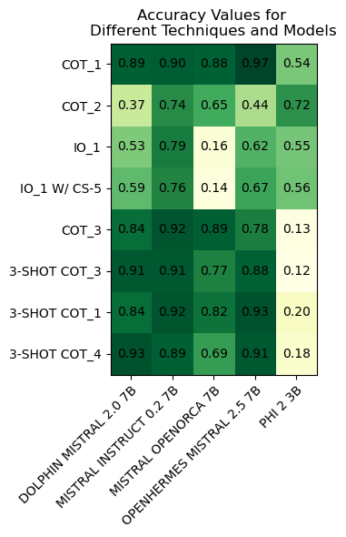
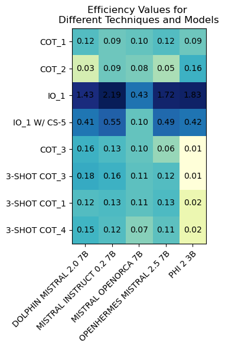

# Analyze-Select-Match (ASM) Method for Local Email Categorization

## Project Overview

This project introduces Analyze-Select-Match (ASM), a novel approach to local email categorization using small language models. The goal is to empower users to organize emails on their local machines by categorizing them into user-defined labels with flexibility in both quantity and quality.

## Author Information

- **Author:** inż. Jakub Matłacz
- **Supervisor** dr inż. Krzysztof Hryniów 
- **Affiliation:** Warsaw University of Technology, Warsaw, Poland

## Abstract

This paper presents the ASM methodology, emphasizing Analyze, Select, and Match stages. The approach uses small language models, and a bespoke dataset of 100 email samples was curated for testing. The highest achieved accuracy was 97%, focusing on maintaining efficiency measured by the accuracy-to-average time ratio for classifying a single message.

## Methodology

### Dataset Creation

A bespoke dataset comprising 100 email samples was curated, with both legitimate and potential categories assigned randomly. The assumed email landscape for each user included approximately ten categories, each with ten subcategories.

### Model Selection

Five models were selected based on widespread graphics card compatibility. Technical details of the models are provided in Table I.

| Model Name | Quantization | Context Length | Parameters |
|------------|--------------|-----------------|------------|
| ehartford dolphin-2.0-mistral-7b | Q6 | K | 32768 | 7B |
| teknium openhermes-2.5-mistral-7b | Q6 | K | 32768 | 7B |
| Phi2 | Q6 | K | 2048 | 3B |
| mistralai mistral-7b-instruct-v0.2 | Q6 | K | 32768 | 7B |
| open-orca mistral-7b-openorca | Q6 | K | 32768 | 7B |

### Inference Parameters

Default inference parameters used in experiments with all language models are as follows:

| Parameter | Value |
|-----------|-------|
| Temperature (temp) | 0.8 |
| Tokens to Generate (n predict) | -1 |
| Top K Sampling (top k) | 40 |
| Repeat Penalty (repeat penalty) | 1.1 |
| Min P Sampling (min p) | 0.05 |
| Top P Sampling (top p) | 0.95 |

## Results

The investigation involved testing five models with various prompt engineering techniques. The openhermes mistral 2.5 7b model, paired with the cot 1 prompt, achieved the highest accuracy at 97%. The results are visualized in Figures 3, 4, and 5.

  

## Conclusions

The developed ASM model aligns with expectations, exhibiting high accuracy, efficient processing times, and user-centric customization. It functions as an agent without the need for retraining, ensuring stability and reliability over extended usage periods.

## Future Work

Future research directions include exploring more intricate prompt engineering techniques, scalability across larger datasets, and integrating advanced natural language processing techniques for adaptability to evolving language patterns. Additionally, user interaction analysis and collaboration with cybersecurity experts for adversarial attack prevention are promising avenues.

## References

- [Steam Hardware & Software Survey](https://store.steampowered.com/hwsurvey/)
- [difflib – Helpers for computing deltas](https://docs.python.org/3/library/difflib.html)
- [LM Studio GitHub Repository](https://github.com/lmstudio-ai)
